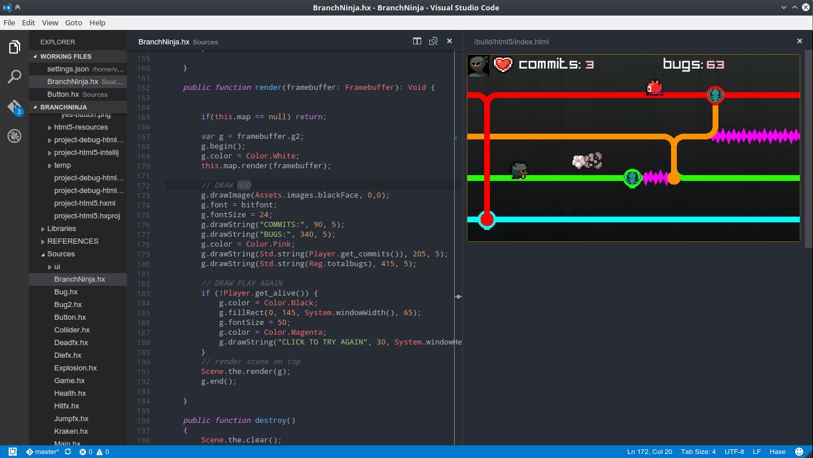

# Live Preview Server
for Visual Studio Code
[Visual Studio Marketplace](https://marketplace.visualstudio.com/items?itemName=varomix.mixliveserver)
## Launch a simple development server with live reloading
Splits the editor, opens a new panel with your website

###Install:
Launch VS Code Quick Open (Ctrl+P), paste the following command, and type enter.

`ext install mixliveserver`



###How to use:

* Set the `rootPath` configuration variable to your project root, where your `index.html` is located. 
* Start the server pressing `F1` or `Command Palette` and run command `Start live server`

### Configuration options:
This can be set in `User Settings` or `Workspace Settings`.

```javascript
{
    "mix.rootPath": "build/html5",
    "mix.port": 8181
}
```
### IMPORTANT
It has to be a **RELATIVE path from where your project file is**, if you have a folder for your project has to be inside there in an export folder or html folder etc.


**Enjoy!**
